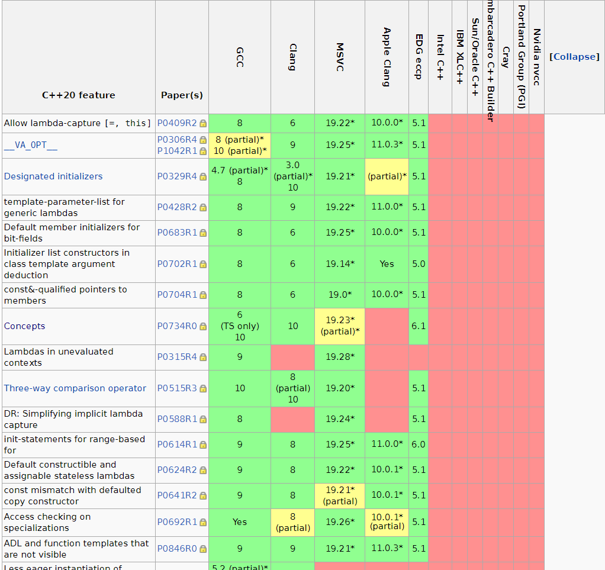
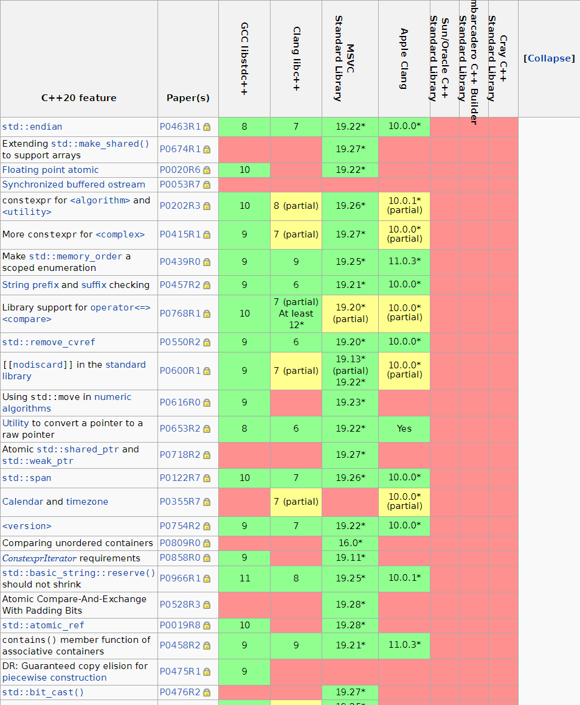

C++20将是一个变革非常巨大的版本
增加的新特性将对C++的开发方式产生非常大的影响
这篇文章带你看看C++20的最新进展
<!-- more -->

# 一. C++20 big four

* concepts：允许对模板类型进行检查
* ranges：对for循环进行优化，减少代码量
* coroutine：协程管理
* module：模块化管理

# 二. 各大编译器对C++20的支持情况

点击这个链接查看: https://en.cppreference.com/w/cpp/compiler_support
截至2020年10月，gcc支持的更加全面，clang和msvc略差

  C++20核心特性支持情况, 部分截图如下:

 

  C++20标准库支持情况, 部分截图如下:

 

# 三. ranges功能测试

下面这段代码在gcc10.1的环境中测试了ranges功能, 我们可以轻松的对一个容器中的每个对象进行处理, 不需要写for循环

```cpp
//main.cpp
#include <iostream>
#include <vector>
#include <ranges>

int main() {
    std::vector<int> ints{0, 1, 2, 3, 4, 5};
    auto even = [](int i) { return 0 == i % 2; };
    auto square = [](int i) { return i * i; };

    for (int i : ints | std::views::filter(even) | std::views::transform(square)) {
        std::cout << i << ' ';
    }
}
```

使用了cmake3.18.4

```cmake
#CMakeLists.txt
cmake_minimum_required(VERSION 3.0.0)
project(test VERSION 0.1.0)

set(CMAKE_CXX_STANDARD 20)
set(CMAKE_EXPORT_COMPILE_COMMANDS ON)

add_executable(test main.cpp)
```

如果打开了cmake这个设置CMAKE_EXPORT_COMPILE_COMMANDS， 将输出一个compile_commands.json文件，该文件中包含编译用到的命令

```shell
"/usr/bin/g++   -g -std=gnu++2a -o CMakeFiles/test.dir/main.cpp.o -c /home/xxx/CppProjects/testgcc10_1/main.cpp"
```

# 四. 参考

* https://www.modernescpp.com/index.php/thebigfour
* https://en.cppreference.com
* https://llvm.org/
* https://gcc.gnu.org/

